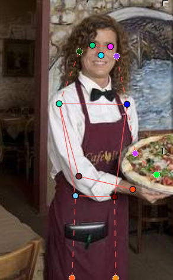
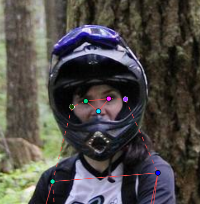
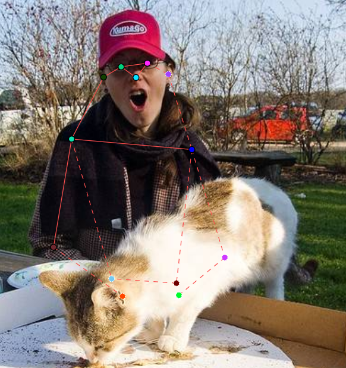
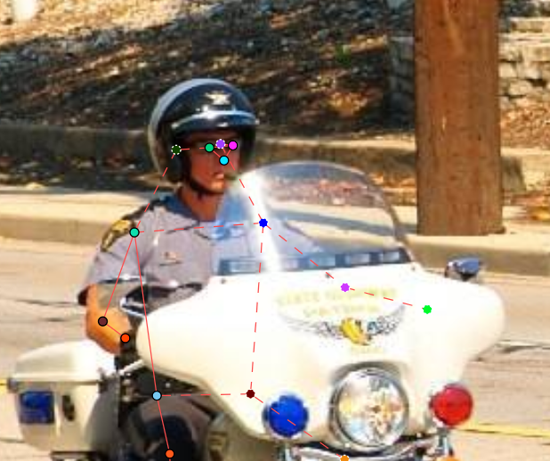
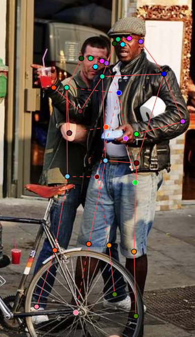
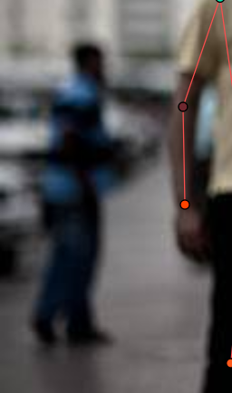
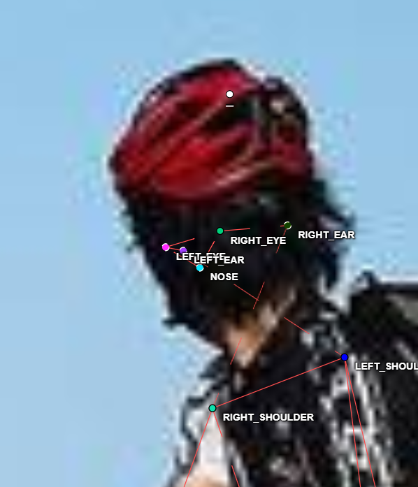
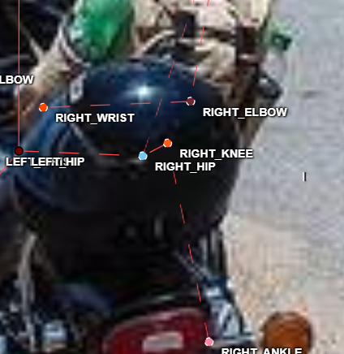
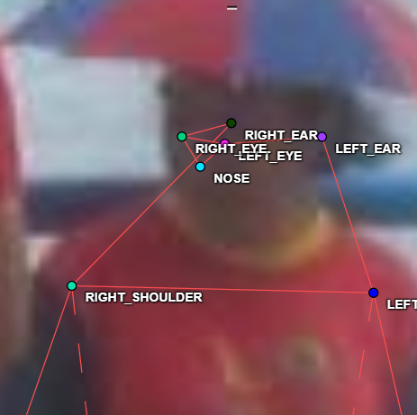

# Mini guideline - nhóm: T049  |  người gán: Hồ Minh Trí  |  ngày: 16/9/2026

> Điền file này **trong lúc** gán nhãn, không phải sau khi xong. Mỗi lần bạn dừng lại
> hơn 10 giây để phân vân, đó là một dòng phải ghi vào đây.

## 1. Luật bắt buộc (đã thống nhất cả lớp - không sửa)

- Bộ 17 điểm COCO, đúng tên, đúng thứ tự. Lấy từ file `.SVG` chung.
- Mọi người trong ảnh đều có **đủ 17 điểm**. Điểm không dùng được thì gắn cờ, không xoá.
- Trái/phải tính theo **cơ thể người**, không theo bức ảnh.
- Bị che, còn trong khung -> `v = 1`, **vẫn đặt chấm** ở vị trí ước lượng.
- Ra ngoài mép ảnh -> `v = 0`, **không** đặt chấm.
- Không dùng `Hidden` (`h`) - nó không được lưu vào file.

## 2. Luật của nhóm bạn (phải điền)

| Tình huống | Luật nhóm bạn chọn | Vì sao |
| --- | --- | --- |
| Hông của người mặc quần áo dài:  | đặt chấm ở vị trí ước lượng theo giải phẫu, không đánh dấu `occluded` | ví trí không không khó để ước lượng nếu có hình ảnh đùi và vai rõ ràng |
| Tai bị tóc hoặc mũ bảo hiểm che một phần:  | đặt chấm ở vị trí ước lượng, đánh dấu `occluded` | |
| Người bị cắt ở mép ảnh (chỉ thấy từ hông trở lên):  | đánh dấu `outside` các chấm ở vị trí dưới hông (đầu gối, mắt cá chân) | |
| Cổ tay nằm sau tay lái / sau thân mình:  | đặt chấm ở vị trí ước lượng theo context, đánh dấu `occluded` |  |
| Hai người chồng lên nhau:  | đặt chấm như bình thường, đánh dấu các khớp bị che là `occluded` | |
| Người nhỏ đến mức nào thì không gán nữa:  | kích thước dưới 50x50 pixel, hoặc hình ảnh quá mờ để nhận dạng đặc điểm người | |

Với mỗi luật, chèn **một ảnh mẫu** (screenshot từ CVAT) thay vì chỉ viết một câu.
Slide 12 nói rõ: khớp không có bề mặt nhìn thấy được thì phải có ảnh mẫu, không phải
một câu văn chung chung.

## 3. Ba ca mơ hồ đã gặp (bắt buộc, ghi ít nhất 3)

### Ca 1 - ảnh `train_02`, người thứ `37`, khớp `nose`

- Mơ hồ ở chỗ nào: Đầu người quay ngược lại hướng camera, không có đặc điểm nhận dạng khác xung quanh, hình ảnh mờ
- Bạn quyết thế nào: Ước tính vị trí theo hướng nhìn của người trong context của ảnh
- Vì sao: Vì vị trí và góc xoay đầu đủ để ước tính vị trí tương đối của mũi
- Nếu người khác quyết ngược lại thì model học sai cái gì: 

### Ca 2 - ảnh `train_09`, người thứ `199`, khớp `right_knee`

- Mơ hồ ở chỗ nào: Context ảnh không rõ về hành động của người, khớp bị che lấp hoàn toàn
- Bạn quyết thế nào: Đặt vị trí chấm theo ước lượng độ rộng khung xe và vị trí khớp `right_ankle`
- Vì sao: Từ vị trí khớp `right_ankle` có thể ước tính được khoảng cách tới khớp `right_knee`, độ rộng hông/khung xe máy xe cho góc xoay tối thiếu của đùi, từ đó ước tính được khoảng cách của đầu gối
- Nếu người khác quyết ngược lại thì model học sai cái gì: 

### Ca 3 - ảnh `train_14`, người thứ `325`, khớp `right_eye` `left_eye`

- Mơ hồ ở chỗ nào: Ảnh mờ, không nhận diện được đặc điểm khuôn mặt người
- Bạn quyết thế nào: Đặt vị trí chấm theo ước lượng giải phẫu khuôn mặt, tính theo góc xoay của đầu
- Vì sao: Dựa vào góc xoay của đầu, kích thước khuôn mặt có thể ước lượng được vị trí các đặc điểm khuôn mặt theo tỉ lệ giải phẫu thông hường
- Nếu người khác quyết ngược lại thì model học sai cái gì: 

## 4. Sau khi so visibility report với bạn cùng nhóm

- Khớp lệch `%v=1` nhiều nhất: `______` (bạn `___%` / họ `___%`)
- Nguyên nhân là **guideline chưa rõ** hay **một trong hai bên gán sai**:
- Luật mới bổ sung vào mục 2 sau khi thống nhất:
